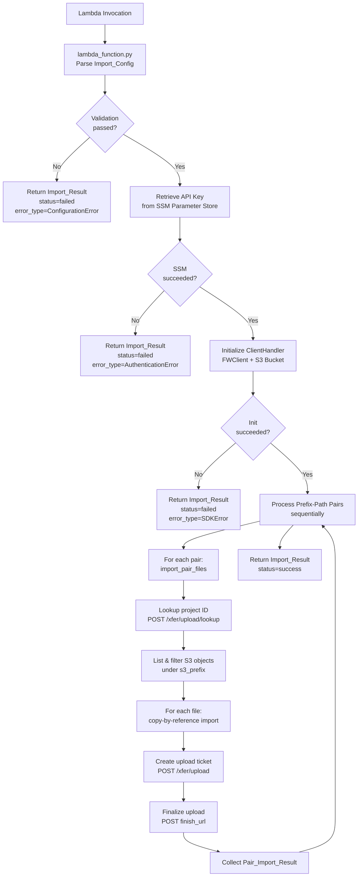

# Design Document: S3 Flywheel Import Lambda

## Overview

This design describes a generalized AWS Lambda function that imports files from S3 into Flywheel projects via copy-by-reference. The Lambda is invoked with a configuration payload containing a `storage_id` (identifying a Flywheel storage pointing at a specific S3 bucket), an SSM path for the Flywheel API key, and a list of prefix-path pairs. Each pair maps an S3 prefix (relative to the storage bucket root) to a Flywheel group/project destination, with optional include/exclude substring filters.

The implementation is extracted and generalized from the reference lambda in `reference/s3-flywheel-import/`. The core `ClientHandler` logic (Flywheel SDK wrapping, S3 listing, two-step upload ticket flow) is preserved largely as-is. The generalization removes LONI-specific defaults, legacy configuration format support, and environment variable fallbacks, replacing them with explicit event-driven configuration validated via Pydantic models.

The Lambda is stateless from the caller's perspective: invoke with config, get back structured results.

### Key Design Decisions

1. **Pydantic over dataclasses**: The reference uses `dataclasses` with manual `validate()` methods. The new implementation uses Pydantic `BaseModel` for automatic validation on construction, eliminating the need for separate validation calls and providing richer error messages.

2. **Prefix-path pairs replace studies**: The reference's `StudyConfig` model uses a single `filter_pattern` with a `filter_mode` (include/exclude). The generalized model uses `PrefixPathPair` with `s3_prefix`, `fw_group`, `fw_project`, and optional `include_patterns`/`exclude_patterns` lists — supporting multiple patterns per pair and per-pair group/project targeting.

3. **No environment variable fallbacks**: The reference falls back to environment variables and hardcoded LONI defaults. The generalized Lambda requires all configuration in the event payload, making it fully stateless and explicit.

4. **ClientHandler filtering changes**: The reference `filter_objects` takes a single include or exclude pattern and lists objects under the storage prefix. The generalized version takes an `s3_prefix` (the pair's prefix within the bucket) and applies lists of include/exclude patterns, with include-first-then-exclude semantics.

5. **Shared modules in `common/`**: `ClientHandler` and models are placed under `common/src/python/` so they can be reused by future lambdas in this monorepo.

## Architecture



### Module Layout

```
common/src/python/
├── flywheel_client/
│   ├── BUILD
│   └── client_handler.py      # ClientHandler class (FWClient + S3 wrapper)
├── s3_import_models/
│   ├── BUILD
│   └── models.py              # Pydantic models: ImportConfig, PrefixPathPair,
│                               #   PairImportResult, ImportResult

lambda/s3_import/
├── src/python/s3_import_lambda/
│   ├── BUILD
│   ├── lambda_function.py     # Lambda handler entry point
│   └── import_operations.py   # import_pair_files orchestration
├── test/python/
│   ├── BUILD
│   ├── conftest.py            # Shared fixtures
│   ├── test_lambda_function.py
│   ├── test_import_operations.py
│   └── test_properties.py     # Property-based tests
```


## Components and Interfaces

### 1. Models (`common/src/python/s3_import_models/models.py`)

#### PrefixPathPair

Pydantic model representing a single S3-prefix-to-Flywheel-project mapping.

```python
class PrefixPathPair(BaseModel):
    s3_prefix: str                              # S3 path relative to storage bucket root
    fw_group: str                               # Flywheel group name
    fw_project: str                             # Flywheel project label
    include_patterns: list[str] = []            # Substring include filters
    exclude_patterns: list[str] = []            # Substring exclude filters
```

Validation: `s3_prefix`, `fw_group`, and `fw_project` must be non-empty strings.

#### ImportConfig

Pydantic model for the full Lambda event payload.

```python
class ImportConfig(BaseModel):
    storage_id: str                             # Flywheel storage ID (identifies S3 bucket)
    api_key_path: str                           # SSM parameter path (must start with '/')
    prefix_path_pairs: list[PrefixPathPair]     # At least one pair required
    dry_run: bool = False                       # Skip Flywheel API calls when True
    aws_profile: str | None = None              # Optional boto3 profile name
```

Validation:
- `storage_id` must be non-empty
- `api_key_path` must start with `/`
- `prefix_path_pairs` must contain at least one entry

#### PairImportResult

Pydantic model for per-pair import results.

```python
class PairImportResult(BaseModel):
    fw_project: str                             # Target project label
    duration: float                             # Seconds elapsed
    file_count: int                             # Successfully imported files
    failed_files: list[dict[str, str]] = []     # List of {"key": ..., "error": ...}
    include_patterns: list[str] = []            # Patterns used
    exclude_patterns: list[str] = []            # Patterns used
```

Validation: `duration >= 0`, `file_count >= 0`.

#### ImportResult

Pydantic model for the overall Lambda response.

```python
class ImportResult(BaseModel):
    status: str                                 # "success" or "failed"
    pair_results: list[PairImportResult] = []
    total_duration: float = 0.0
    total_file_count: int = 0
    error_message: str | None = None
    error_type: str | None = None               # ConfigurationError, AuthenticationError,
                                                # SDKError, UnexpectedError
    context: dict[str, Any] | None = None
```

Validation: `total_file_count` must equal the sum of `file_count` across all `pair_results`.

### 2. ClientHandler (`common/src/python/flywheel_client/client_handler.py`)

Wraps `FWClient` (Flywheel SDK) and `boto3` S3 operations. Adapted from the reference implementation with the following changes:

- `filter_objects` now accepts `s3_prefix`, `include_patterns`, and `exclude_patterns` (lists) instead of a single pattern with mode
- Include-first-then-exclude filtering semantics
- Zero-byte objects (directory markers) are skipped during filtering
- Uses generator/lazy iteration for memory efficiency

```python
class ClientHandler:
    def __init__(
        self,
        fw_api_key: str,
        fw_storage_id: str,
        aws_profile: str | None = None,
        dry_run: bool = False,
    ) -> None: ...

    @property
    def fw_storage_prefix(self) -> str: ...

    @property
    def fw_provider_id(self) -> str: ...

    def get_project_id(self, group: str, label: str) -> str:
        """POST /xfer/upload/lookup to resolve group+label to project ID."""
        ...

    def filter_objects(
        self,
        s3_prefix: str,
        include_patterns: list[str] | None = None,
        exclude_patterns: list[str] | None = None,
    ) -> Iterator[Any]:
        """List S3 objects under s3_prefix, apply include then exclude filters.
        Skips zero-byte objects. Yields S3 ObjectSummary instances lazily."""
        ...

    def import_to_flywheel(self, project_id: str, file: Any) -> dict[str, Any]:
        """Two-step copy-by-reference: create upload ticket, then finalize.
        Skipped in dry_run mode. Raises ValueError if reference!=True."""
        ...
```

### 3. Import Operations (`lambda/s3_import/src/python/s3_import_lambda/import_operations.py`)

Orchestrates the import for a single `PrefixPathPair`. Adapted from the reference `import_study_metadata` function.

```python
def import_pair_files(
    client: ClientHandler,
    pair: PrefixPathPair,
) -> PairImportResult:
    """Import all matching S3 objects for a single prefix-path pair.
    
    1. Look up project ID via client.get_project_id(pair.fw_group, pair.fw_project)
    2. List and filter objects via client.filter_objects(pair.s3_prefix, ...)
    3. Import each file, tracking successes and failures individually
    4. Return PairImportResult with metrics
    """
    ...
```

### 4. Lambda Handler (`lambda/s3_import/src/python/s3_import_lambda/lambda_function.py`)

Entry point. Thin handler that parses config, retrieves API key, initializes ClientHandler, loops over pairs, and returns structured results.

```python
def lambda_handler(event: dict[str, Any], context: LambdaContext) -> dict[str, Any]:
    """
    1. Parse event into ImportConfig (Pydantic validation)
    2. Retrieve API key from SSM via api_key_path
    3. Initialize ClientHandler with API key, storage_id, aws_profile, dry_run
    4. For each PrefixPathPair: call import_pair_files, collect results
    5. Return ImportResult.model_dump()
    
    Error handling:
    - ValidationError → status=failed, error_type=ConfigurationError
    - SSM errors → status=failed, error_type=AuthenticationError
    - HTTPError (Flywheel) → status=failed, error_type=SDKError
    - Exception → status=failed, error_type=UnexpectedError
    """
    ...
```

### 5. SSM Parameter Retrieval

A standalone function (in `lambda_function.py` or a small utility) that retrieves the API key from SSM. Adapted directly from the reference `get_parameters` function.

```python
def get_api_key(api_key_path: str, aws_profile: str | None = None) -> str:
    """Retrieve Flywheel API key from SSM Parameter Store.
    
    Raises RuntimeError with descriptive message on:
    - ParameterNotFound
    - AccessDeniedException
    - Other SSM errors
    """
    ...
```


## Data Models

### ImportConfig (Lambda Event Schema)

```json
{
  "storage_id": "691c926ff8220b709983b848",
  "api_key_path": "/prod/flywheel/gearbot/apikey",
  "prefix_path_pairs": [
    {
      "s3_prefix": "centers/1florida",
      "fw_group": "1florida",
      "fw_project": "distribution-data-freeze",
      "include_patterns": [],
      "exclude_patterns": []
    }
  ],
  "dry_run": false,
  "aws_profile": null
}
```

### ImportResult (Lambda Response Schema)

```json
{
  "status": "success",
  "pair_results": [
    {
      "fw_project": "distribution-data-freeze",
      "duration": 45.5,
      "file_count": 150,
      "failed_files": [
        {"key": "centers/1florida/bad-file.csv", "error": "HTTPError: 500"}
      ],
      "include_patterns": [],
      "exclude_patterns": []
    }
  ],
  "total_duration": 48.3,
  "total_file_count": 150,
  "error_message": null,
  "error_type": null,
  "context": null
}
```

### Flywheel API Data Structures

#### Storage Config (from `GET /xfer/storages/{storage_id}`)

```python
# Response object attributes used:
storage.config.bucket   # str — S3 bucket name
storage.config.prefix   # str — storage prefix path
storage.provider        # str — provider ID for upload tickets
```

#### Upload Ticket (from `POST /xfer/upload`)

```python
# Request payload:
{
    "project": {"id": "<project_id>"},
    "file": {
        "name": "<filename>",
        "path": "<path_relative_to_storage_prefix>",
        "size": <file_size_bytes>,
        "provider_id": "<provider_id>",
        "reference": True
    },
    "conflict_strategy": "update"
}

# Response object attributes used:
ticket.finish_url   # str — URL to POST to finalize the upload
ticket._id          # str — ticket ID for finalization payload
ticket.file.reference  # bool — must be True for copy-by-reference
```

### Filtering Logic

For a given `PrefixPathPair`, the filtering pipeline is:

1. List all S3 objects under `s3_prefix` within the storage bucket
2. Skip objects with `size == 0` (directory markers)
3. If `include_patterns` is non-empty: keep only objects whose key contains at least one include pattern
4. If `exclude_patterns` is non-empty: remove objects whose key contains any exclude pattern
5. Yield remaining objects lazily

This is a change from the reference, which supported only a single pattern with a mode toggle. The new approach supports multiple patterns and always applies include-before-exclude.


## Correctness Properties

*A property is a characteristic or behavior that should hold true across all valid executions of a system — essentially, a formal statement about what the system should do. Properties serve as the bridge between human-readable specifications and machine-verifiable correctness guarantees.*

### Property 1: ImportConfig round-trip parsing

*For any* valid `ImportConfig` instance, serializing it to a dictionary (as a Lambda event payload) and then parsing that dictionary back into an `ImportConfig` should produce an equivalent object with the same `storage_id`, `api_key_path`, `dry_run`, `aws_profile`, and the same number of `PrefixPathPair` entries with identical field values.

**Validates: Requirements 1.1**

### Property 2: ImportConfig validation rejects invalid configs with identifying messages

*For any* `ImportConfig` where `storage_id` is empty, or `api_key_path` does not start with `/`, or `prefix_path_pairs` is empty, construction/validation should raise an error whose message contains the name of the invalid field.

**Validates: Requirements 1.2, 1.3**

### Property 3: S3 object filtering correctness

*For any* list of S3 objects (with varying keys and sizes), any list of include patterns, and any list of exclude patterns: the filtered output should satisfy all of the following:
- Every yielded object has `size > 0`
- If include patterns are non-empty, every yielded object's key contains at least one include pattern as a substring
- No yielded object's key contains any exclude pattern as a substring
- The filtering result is the same as applying include-first-then-exclude sequentially

**Validates: Requirements 4.2, 4.3, 4.4, 4.5**

### Property 4: Dry run skips Flywheel import API calls

*For any* S3 file object and any project ID, when `dry_run` is `True`, calling `import_to_flywheel` should not invoke any Flywheel upload or finalization API calls, and should return an empty result.

**Validates: Requirements 5.5**

### Property 5: Import pair result tracks counts and failures correctly

*For any* list of S3 file objects where a known subset of imports fail, the resulting `PairImportResult` should have `file_count` equal to the number of successful imports, `failed_files` containing exactly the failed file keys with error messages, and all files should be attempted regardless of individual failures.

**Validates: Requirements 6.1, 6.2, 6.3**

### Property 6: Pair-level fault isolation

*For any* list of `PrefixPathPair` entries where some pairs fail during project lookup or processing, the Lambda should still attempt all remaining pairs and return results for the pairs that succeeded.

**Validates: Requirements 6.4**

### Property 7: Total file count aggregation invariant

*For any* list of `PairImportResult` instances, constructing an `ImportResult` with `total_file_count` not equal to the sum of individual `file_count` values should raise a validation error.

**Validates: Requirements 7.2**

### Property 8: ImportResult serialization completeness

*For any* valid `ImportResult` instance, serializing it to a dictionary should produce a dict containing all required keys: `status`, `pair_results`, `total_duration`, `total_file_count`, `error_message`, `error_type`, and `context`.

**Validates: Requirements 7.1, 7.6**


## Error Handling

### Error Classification

| Error Type | Trigger | Response |
|---|---|---|
| `ConfigurationError` | Pydantic `ValidationError` during `ImportConfig` parsing | `status=failed`, validation error details in `error_message` |
| `AuthenticationError` | SSM `ParameterNotFound` or `AccessDeniedException` | `status=failed`, SSM path and error in `error_message` |
| `SDKError` | `HTTPError` from Flywheel SDK (`fw-client`) during init or API calls | `status=failed`, API error in `error_message` |
| `UnexpectedError` | Any other unhandled `Exception` | `status=failed`, error + stack trace context in `error_message` |

### Error Boundaries

1. **Configuration parsing** (outermost): Catches `ValidationError` before any external calls are made. Returns immediately with `ConfigurationError`.

2. **SSM retrieval**: Catches SSM-specific exceptions (`ParameterNotFound`, `AccessDeniedException`) and wraps them as `RuntimeError` with `AuthenticationError` classification.

3. **ClientHandler initialization**: Catches `HTTPError` from the Flywheel storage config retrieval. Returns `SDKError`.

4. **Per-pair processing**: Each `PrefixPathPair` is processed in a try/except block. If a pair fails (e.g., project lookup fails), the error is logged and the Lambda continues to the next pair. The failed pair does not produce a `PairImportResult`.

5. **Per-file processing**: Within a pair, each file import is wrapped in a try/except. Failed files are recorded in `PairImportResult.failed_files` with the key and error message. Processing continues with the next file.

### Dry Run Behavior

When `dry_run=True`:
- SSM retrieval and ClientHandler initialization proceed normally (to validate connectivity)
- `import_to_flywheel` logs the intended operation but skips the upload ticket creation and finalization API calls
- Returns an empty dict instead of the finalization response
- File counts reflect zero imports (since no actual imports occur)

## Testing Strategy

### Dual Testing Approach

The testing strategy uses both unit tests and property-based tests:

- **Unit tests** (pytest): Verify specific examples, edge cases, error conditions, and integration wiring (mocked external services)
- **Property-based tests** (Hypothesis): Verify universal properties across randomly generated inputs

### Property-Based Testing Configuration

- **Library**: [Hypothesis](https://hypothesis.readthedocs.io/) for Python
- **Minimum iterations**: 100 per property test (via `@settings(max_examples=100)`)
- **Tag format**: Each property test includes a comment referencing the design property:
  `# Feature: s3-flywheel-import, Property {number}: {property_text}`
- Each correctness property is implemented by a single Hypothesis test function

### Unit Test Coverage

Unit tests cover:
- **Models**: Valid/invalid config construction, default values, edge cases (empty patterns, missing fields)
- **ClientHandler**: Initialization wiring, project lookup, upload ticket flow, dry run behavior (all with mocked FWClient and boto3)
- **Import operations**: Single pair import with mocked ClientHandler, partial failures, empty result sets
- **Lambda handler**: End-to-end flow with mocked dependencies, error classification for each error type, context object handling
- **Logging**: Verify structured log output at key stages (optional, lower priority)

### Property Test Coverage

Property tests cover the 8 correctness properties defined above:
1. ImportConfig round-trip parsing
2. ImportConfig validation rejects invalid configs
3. S3 object filtering correctness
4. Dry run skips API calls
5. Import pair result tracks counts and failures
6. Pair-level fault isolation
7. Total file count aggregation invariant
8. ImportResult serialization completeness

### Test File Organization

```
lambda/s3_import/test/python/
├── BUILD
├── conftest.py                 # Shared fixtures (mock ClientHandler, mock S3 objects, etc.)
├── test_lambda_function.py     # Unit tests for handler
├── test_import_operations.py   # Unit tests for import_pair_files
└── test_properties.py          # Hypothesis property-based tests

common/test/python/
├── BUILD
├── test_client_handler.py      # Unit tests for ClientHandler
├── test_models.py              # Unit tests for Pydantic models
└── test_model_properties.py    # Hypothesis property-based tests for models
```

### Mock Strategy

- **FWClient**: Mocked via `unittest.mock.patch` on `fw_client.FWClient`
- **boto3**: Mocked via `unittest.mock.patch` on `boto3.Session`
- **SSM**: Mocked via `unittest.mock.patch` on `boto3.client("ssm")`
- Mock factories centralized in `conftest.py` fixtures
- External services are always mocked; internal logic is tested directly

### Dependencies

Add to `requirements.txt`:
- `hypothesis>=6.100.0` — Property-based testing library

